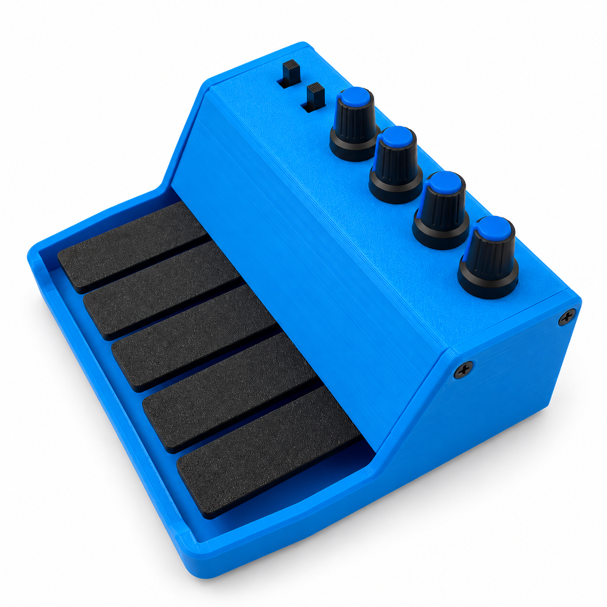

# Teletype MIDI Controller

Controller firmware and a browser-based configuration app for Teletype: **5 buttons, 4 banks and 4 potentiometers**, with USB MIDI and hardware MIDI output.

<a href="docs/images/teletype-three-quarter-white-v1.png">
  
</a>

*Click the image to open the full-size version.*

## Download firmware

**[Download Teletype v1.0.1 UF2](firmware/teletype-v1.0.1.uf2?raw=true)** — ready to flash; no compilation or ZIP extraction needed.

Open the **[browser uploader](https://deladriere.github.io/RPI_Uploader/rp2040-uploader.html)** in Chrome or Edge to install it. Follow the [update steps below](#update-firmware-with-the-browser-uploader). For a manual installation, hold **BOOTSEL** while connecting USB, release it, then copy the downloaded UF2 to the **RPI-RP2** drive.

Firmware v1.0.1 fixes USB startup so the serial upload interface is retained alongside MIDI. If the serial port is missing after an earlier build, install this UF2 using BOOTSEL once. The MIDI monitor needs no firmware update. Compilation and host tests pass; hardware validation of this downloadable build remains pending.

## Configure your Teletype

If your controller already has the Teletype firmware, start here. No firmware build or installation is needed to use the GUI.

1. Open **[Teletype online](https://deladriere.github.io/TeleTypeController/)** in desktop **Chrome or Edge**. Nothing to download or install.
2. Connect Teletype to your computer with a USB data cable.
3. Click **Connect MIDI** and allow MIDI/SysEx access. If several MIDI devices are available, choose Teletype from the device list.
4. Wait for the firmware version and connected status. The GUI reads the device’s current mappings. Knob values appear when MIDI messages arrive.
5. Open **Configure**, edit a button note or pot mapping and click its **Set** button. Click **Save** to keep your applied settings after power-off.

You can also download this repository (**Code → Download ZIP**), extract it, and open [`GUI/index.html`](GUI/index.html) locally.

The GUI needs no package installation or frontend build. Keep `index.html`, `style.css`, `protocol.js`, `visual.js` and `app.js` together in the `GUI` folder. Configuration uses USB MIDI SysEx; the monitor reads ordinary MIDI notes, CC and pitch bend.

If MIDI access is unavailable when opening the file directly, serve the repository locally with Python 3:

```sh
python3 -m http.server 8000 --bind 127.0.0.1
```

Then open [the local GUI](http://localhost:8000/GUI/index.html) in Chrome or Edge. Stop the server with Ctrl+C when finished. A hosted copy must use HTTPS; see [Chromium's Web MIDI notes](https://new.chromium.org/developers/design-documents/web-midi/).

## Watch your Teletype

The **Monitor** tab follows MIDI from the physical controller. Press a key to flash its illustration; turn a knob to update its displayed value. The drawing is read-only and sends no performance messages or polling requests. No firmware update is needed for this view.

- Knob values remain unknown until their MIDI messages arrive. Muted knobs send no updates.
- The bank is inferred from the last uniquely mapped note. Moving a bank switch alone sends no MIDI, so it cannot update the display until a note is played.
- If several keys share a note, the GUI shows the note and a shared-mapping message instead of guessing which key was pressed.
- Knobs sharing the same CC, or configured for pitch bend, update together; MIDI cannot identify the source knob.
- The **Configure** tab retains the existing Set, Save, Load and Reset commands.

## Controls and settings

Each bank provides five note mappings, for **20 note slots** in total. Banks are numbered **1–4** in the GUI (0–3 in the firmware protocol). A button press sends a short note trigger at velocity 127, followed by Note Off about 5 ms later. Holding a button does not sustain the note.

The four pots can each send **CC** (Control Change, controller number 0–127) or **PB** (Pitch Bend). Button notes, CC and pitch bend are sent to both USB MIDI and the hardware MIDI output.

| GUI control | What it does |
| --- | --- |
| **Set** | Applies that button or pot mapping to the device's working configuration. |
| **Button channel / Knob channel** | Choose channel 1–16, then click the adjacent **Set** button. |
| **Mute** | Click the knob’s **Set** button to apply its mute setting. A muted knob sends no MIDI. |
| **Save** | Stores the device’s working configuration in flash. Unapplied edits must be applied with **Set** first; otherwise Save is blocked. |
| **Load** | Reloads the last saved configuration and refreshes the GUI. Unsaved changes are discarded. |
| **Reset** | Restores factory defaults in the working configuration and refreshes the GUI. Click **Save** to keep those defaults. |

### Factory defaults

| Control | Default mapping |
| --- | --- |
| Bank 1, buttons 1–5 | Notes 36–40 |
| Bank 2, buttons 1–5 | Notes 41–45 |
| Bank 3, buttons 1–5 | Notes 46–50 |
| Bank 4, buttons 1–5 | Notes 51–55 |
| Pots 1–4 | CC 1, 2, 74, 71; all unmuted |
| Button and pot MIDI channels | Channel 1 |

On startup, the firmware loads a valid saved configuration or uses factory defaults. **Load** reports an error if no valid configuration has been saved yet; use **Reset**, then **Save** to create one.

## Update firmware with the browser uploader

For a controller that already runs firmware with USB bootloader-reset support, open the **[RP2040 Web Uploader](https://deladriere.github.io/RPI_Uploader/rp2040-uploader.html)** in desktop **Chrome or Edge**. It runs directly in your browser; there is no uploader to download or install. This method is intended for updates without opening the case to reach BOOTSEL.

Download **[teletype-v1.0.1.uf2](firmware/teletype-v1.0.1.uf2?raw=true)** first. No compilation is needed. The uploader is shared with Talko 2, but the firmware file must be for Teletype.

1. Open the [online uploader](https://deladriere.github.io/RPI_Uploader/rp2040-uploader.html).
2. Connect Teletype by USB. Close any serial monitor using its port.
3. Click **Pick Device** and choose the controller's USB serial port.
4. Click **Reboot to Bootloader**. Wait for the **RPI-RP2** drive to appear.
5. Click **Pick RPI-RP2 Drive** and select the root of that drive, allowing browser write access when prompted.
6. Click **Select UF2 File**, choose the Teletype firmware, then click **Write UF2 to Drive**.
7. After the controller restarts, reconnect in the configuration GUI and check its firmware version and settings.

Firmware v1.0.1 preserves the USB CDC interface and TinyUSB 1200-baud reset handler used by this uploader. Compilation and a USB-startup regression test pass; an end-to-end Teletype update still needs a hardware test. A blank board, or firmware that cannot respond to the reset, requires the manual BOOTSEL method below.

More information: [Polaxis uploader guide](https://www.polaxis.be/remote-raspberry-pi-pico-uploader/) · [Uploader source code](https://github.com/deladriere/RPI_Uploader).

## Build and install the firmware from source

The project uses **PlatformIO**, the **Arduino-Pico** core and the `pico` build environment. Its GPIO assignments are listed in the [pin map](pinmap.md).

Install [PlatformIO Core](https://docs.platformio.org/en/latest/core/installation/index.html) or the PlatformIO extension for VS Code, then run these commands from the repository root:

```sh
# Build only
pio run -e pico

# Build and upload to a connected controller
pio run -e pico -t upload
```

The first build downloads the platform, toolchain and libraries specified in [`platformio.ini`](platformio.ini). Core integration details are in the [Arduino-Pico PlatformIO documentation](https://arduino-pico.readthedocs.io/en/stable/platformio.html).

For a manual installation, hold the board's **BOOTSEL** button while connecting USB, then release it and copy `.pio/build/pico/firmware.uf2` to the **RPI-RP2** drive. The board reboots into the firmware. This also provides a recovery path if automatic upload cannot find the controller.

[`upload.sh`](upload.sh) is an optional macOS/Linux helper for triggering the USB serial bootloader reset before a PlatformIO upload. Pass the controller's serial port explicitly if several serial devices are connected.

### Build checked on 2026-10-07

The local build passed with platform revision `4d1ad09d78445f16688627de0819646fd655910e`, Arduino-Pico 4.7.0, Adafruit TinyUSB 3.7.3, Adafruit NeoPixel 1.15.2 and MIDI Library 5.0.2. Dependency ranges in `platformio.ini` may resolve to newer versions on another machine. Compilation does not replace a hardware test of MIDI output and saved settings.

## Hosting the GUI

The GUI is hosted at **[deladriere.github.io/TeleTypeController](https://deladriere.github.io/TeleTypeController/)**. GitHub Pages publishes the `master` branch from `/` (root). With this configuration, the root `index.html` opens `GUI/index.html`; `/GUI/` also opens the app directly. No separate GUI repository or build pipeline is required. Publish the whole `GUI` app folder, including its CSS and JavaScript. The app includes its device drawing and needs no preview assets.

## Developer checks

```sh
sh tests/run.sh
pio run -e pico
```

The host tests check protocol frames, passive MIDI interpretation, duplicate mappings, physical MIDI output and muted knobs. Browser checks with simulated MIDI cover monitoring without outgoing messages, configuration and reconnecting. Real USB/physical MIDI output and flash persistence still need a hardware test of the downloadable build.

## Repository contents

| Path | Purpose |
| --- | --- |
| [`firmware/`](firmware/) | Ready-to-flash Teletype UF2 |
| [`src/`](src/) | Firmware, factory defaults and SysEx command definitions |
| [`GUI/index.html`](GUI/index.html) | Monitor and Configure app; `controller.html` redirects here |
| [`GUI/README.md`](GUI/README.md) | GUI development and troubleshooting notes |
| [`platformio.ini`](platformio.ini) | Firmware build configuration and dependencies |
| [`SYSEX_Protocol.md`](SYSEX_Protocol.md) | USB MIDI configuration protocol |
| [`EEPROM_Memory_Map.md`](EEPROM_Memory_Map.md) | Saved configuration layout |
| [`pinmap.md`](pinmap.md) | Firmware GPIO assignments |
| [`docs/images/`](docs/images/) | Product image used by this README |

The ready-to-flash UF2 in `firmware/` is included in Git. Other build output, editor settings and local caches are excluded.

## Design credits

Teletype's key and hinge geometry was adapted from Adafruit's [USB MIDI Keyset Controller](https://learn.adafruit.com/midi-keyset) and the earlier [USB Keyset](https://learn.adafruit.com/usb-keyset), with mechanical design by the **Ruiz Brothers**. The original project guides credit the Ruiz Brothers and Liz Clark. Polaxis remodelled the geometry for Teletype.

The original mechanical design files are linked from Adafruit's [CAD Files page](https://learn.adafruit.com/midi-keyset/cad-files). This credit concerns the mechanical design; it does not assign an Adafruit licence to the Teletype firmware or browser app. Third-party software dependencies retain their own licences.

Teletype is a Polaxis product and is not an Adafruit product or endorsement.
